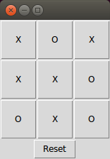

# Q-learning-Tic-Tac-Toe
Reinforcement learning of the game of Tic Tac Toe in Python.

## Basic usage
To play Tic Tac Toe against a computer player trained by playing 200,000 games against itself, enter

`python Tic_Tac_Toe_Human_vs_QPlayer.py` 

at the command line. (You'll need to have Python installed with the Numpy package). This will bring up a simple GUI in which clicking on any of the buttons causes the mark "X" to appear and the computer to immediately respond with a countermove (Figure 1).

  
**Figure 1.** A Tic Tac Toe game which resulted in a tie (cat's game).

I was unable to beat the `QPlayer`, and would be interested to hear if you can!

Alternatively, the user can also play against the "T-hand" player by setting `player2 = THandPlayer(mark="O")` at the bottom of the code. The "T-hand" player makes winning moves if they are available and blocks those of opponents (cf. [Boyan (1992)](http://www.cs.cmu.edu/~jab/cv/pubs/boyan.backgammon-thesis.pdf)), otherwise choosing moves at random. Unlike the QPlayer, it can frequently be beaten with the right strategy.

## Background
The implementation of Q-learning follows the pseudo-code given by Meeden [[CS63 Lab 6](https://www.cs.swarthmore.edu/~meeden/cs63/f11/lab6.php)]. A general introduction to Q-learning can be obtained from [Chapter 13](https://www.cs.swarthmore.edu/~meeden/cs63/f11/ml-ch13.pdf) of [Mitchell (1997)](http://www.cs.cmu.edu/~tom/mlbook.html), [Sutton & Barto (2012)](http://people.inf.elte.hu/lorincz/Files/RL_2006/SuttonBook.pdf), or [Watkins & Dayan (1992)](http://www.gatsby.ucl.ac.uk/~dayan/papers/cjch.pdf), for example.

In the game of Tic Tac Toe, at each discrete time step , the state  of the system is defined by the marks on the board and which player's turn it is, and the available actions  by the empty squares on the board. We are looking for a policy  which tells us which action to take in which state to maximize our chance of winning.

Given a policy , at any given time each state has a certain _value_ , which is the expected discounted reward from following that policy for all future time:

where  is the _reward_ at time step  and  represents the _discount factor_. 

In our implementation of Tic Tac Toe, we adopt the 'sign convention' that reward is positive for player "X" -- specifically, a reinforcement of `1.0` is awarded when player "X" wins, `-1.0` when player "O" wins, and `0.5` in the case of a tie. Hence, player "X" seeks to maximize value, whereas player "O" seeks to minimize it. The discount factor  is given a value of `0.9`. (Its value is not so important in Tic Tac Toe as the game is deterministic with a finite time horizon).

We seek to find the optimum policy  such that the value achieves a unique optimum value . To this end, we define the evaluation function  as the maximum discounted cumulative reward that can be obtained by starting from state  and applying  as first action:

,

where  is the state that results from applying action  in state .

However, to optimize the total future discounted reward, the action  must be the one which maximizes :

which, upon inserting into the above equation, leads to _Bellman's equation_:

This recursive definition of  provides the basis for Q-learning. Suppose we start with some initial estimate  of  and choose an action , thereby obtaining an immediate reward  and arriving at a new state . If our estimate  is correct, we would expect the difference

to be zero. If it is not zero, but slightly positive (negative), then the action and resulting reward can be viewed as 'evidence' that our estimate was too low (high).

The way this 'discrepancy' is handled is by simply adding this difference, weighted by a _learning factor_ , to our previous estimate  to obtain a revised estimate :

In this implementation of Q-learning for Tic Tac Toe, `Q` has the form of a dictionary, the keys of which are the states of the game (represented by the game's `Board` and the mark of player whose turn it is) and the values are again dictionaries containing the current estimate of the `Q` for each available move (i.e., empty square). Bellman's equation is implemented in the `learn_Q` method of the `Game` class, which is called on every move. 

The game's `Q` is shared with any instances of `QPlayer` playing the game, which uses it to make its move decisions. Following the implementation by Heisler [[q.py](https://gist.github.com/fheisler/430e70fa249ba30e707f), [slides](http://slides.com/fheisler/q-learning#/)], the `QPlayer` follows an "-greedy" policy, meaning that with probability  it chooses a random move, and otherwise it follows the policy dictated by `Q` -- that is, if the player has mark "X" ("O"), choose the move with the highest (lowest) Q-value, in accordance with our 'sign convention'. During training, `epsilon` is set to a high value to encourage exploration, whereas for the actual match against a human, it is set to zero for optimal performance.

## Discussion
After 200,000 training games against itself with `epsilon=0.9`, the `QPlayer` seems practically unbeatable by a human player. It would be instructive, however, to check this by pitting it against a player following the [minimax](https://en.wikipedia.org/wiki/Minimax) algorithm for many games. It would also be interesting to check the finding by [Boyan (1992)](http://www.cs.cmu.edu/~jab/cv/pubs/boyan.backgammon-thesis.pdf) that a Q-learned player is able to beat the "T-hand" player 58% of the time and draw the remaining 42%.

